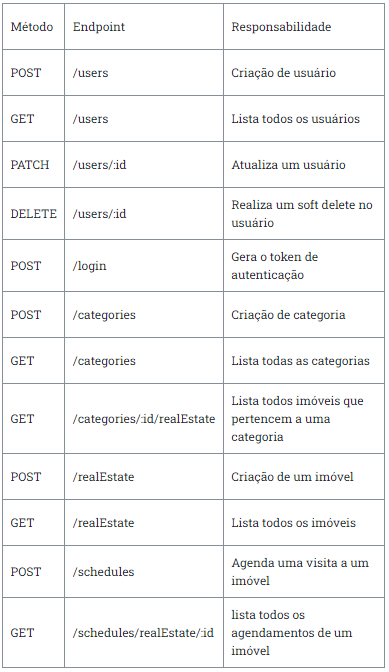

# KI-móveis - TypeORM com Relacionamentos
O Ki-movies é uma API Restful completa, voltada para a gestão de imobiliárias, que permite aos usuários realizar diversas operações, como criação, cadastro, atualização e exclusão de imóveis, além de agendar visitas e listar usuários e imobiliárias. O objetivo central do Ki-movies é oferecer uma solução completa e segura para a gestão de imobiliárias de forma eficiente e confiável.

#

## Diagramas de entidade relacionamento:


#
Para inciar este projeto, é necessário instalar as dependências, que serão utilizadas nos testes. Portanto utilize o comando abaixo para instalar tais dependências:

```bash
# caso use npm
npm install

# caso use yarn
yarn
```

## Configurando dotenv
**Configure as variáveis de ambiente no seu .env**, passando as credenciais corretas para conectar em seu banco local. Siga o exemplo do arquivo **.env.example**.


## Rodando a aplicação
Com isso feito, para rodar sua aplicação, basta utilizar o comando:
```bash
# caso use npm
npm run dev

# caso use yarn
yarn dev
```

## 🚀 Tecnologias Usadas
<ul>
    <li>NodeJS</li>
    <li>TypeScript</li>
    <li>Express</li>
    <li>TypeORM</li>
    <li>PostgreSQL</li>
    <li>BcryptJS</li>
    <li>JSON Web Token</li>
    <li>Zod (para validação de dados)</li>
    <li>Jest</li>
    <li>Supertest</li>
    <li>Dotenv</li>
</ul>

#
## ⚙ Funcionalidades
<ul>
    <li>Cadastro e modificação de usuários e imóveis.</li>
    <li>Agendamentos de visitas a imóveis.</li>
    <li>Login e autenticação JWT.</li>
    <li>Hash de senha</li>
    <li>Soft delete</li>
</ul>

#
## Endpoints do serviço:

### POST - /users
<ul>
  <li>Rota para criação de usuário com os seguintes dados:</li>
  <li>name: string </li>
  <li>email: string </li>
  <li>password: Deverá receber uma string mas armazenar uma hash gerada com o bcrypt</li>
</ul>

### GET - /users
<ul>
  <li>A rota retorna todos os dados dos usuários, com exceção da hash de senha.</li>
  <li>A rota pode ser acessada apenas por administradores.</li>
</ul>

### PATCH - /users/:id
<ul>
  <li>A rota atualizará os dados do usuário.</li>
  <li>Não é possível atualizar os campos id, isAdm e isActive.</li>
  <li>Apenas administradores podem atualizar qualquer usuário, usuários não-administradores podem apenas atualizar seu próprio usuário.</li>
</ul>

### DELETE - /users/:id
<ul>
  <li>A rota realizarar um soft delete do usuário.</li>
  <li>Não é possível atualizar os campos id, isAdm e isActive.</li>
  <li>Apenas administradores podem atualizar qualquer usuário, usuários não-administradores podem apenas atualizar seu próprio usuário.</li>
</ul>

### POST - /login
<ul>
  <li>Rota de login recebendo email e password</li>
  <li>O login valida se o usuário existe e se a senha está correta, não é possível realizar o login de um usuário deletado.</li>
</ul>
  
### POST - /categories
<ul>
  <li>Rota para criação de categorias com os seguintes dados:</li>
  <li>name: string</li>
  <li>Não é possível ser cadastrada duas categorias com o mesmo nome.</li>
  <li>A rota pode ser acessada apenas por administradores.</li>
  </ul>
  
### GET - /categories
<ul>
  <li>A rota lista todas as categorias.</li>
  <li>A rota não precisa de autenticação para ser acessada.</li>
</ul> 
  
### GET - /categories/:id/realEstate
<ul>
  <li>A rota lista todos os imóveis que pertencem a uma categoria.</li>
  <li>A rota não precisa de autenticação para ser acessada.</li>
</ul> 
  
### POST - /realEstate
<ul>
  <li>Rota para criação de um imóvel com os seguintes dados:</li>
  <li>value: number</li>
  <li>size: number</li>
  <li>address: um objeto com os seguintes dados:</li>
  <ol>
    <li>street: string</li>
    <li>zipCode: string</li>
    <li>number: string</li>
    <li>city: string</li>
    <li>state: string</li>
  </ol>
  <li>categoryId: string</li>
  <li>Não podem ser cadastrados dois imóveis com o mesmo endereço.</li>
  <li>A rota pode ser acessada apenas por administradores.</li>
  <li>Não podem ser cadastrados imóveis com o campo <strong>state</strong> maior que 2 dígitos.</li>
  <li>Não podem ser cadastrados imóveis com o campo <strong>zipCode</strong> maior que 8 dígitos.</li>
</ul> 
 
### GET - /realEstate
<ul>
  <li>A rota lista todos os imóveis.</li>
  <li>A rota não precisa de autenticação para ser acessada.</li>
</ul> 
  
### POST - /schedules
<ul>
  <li>Rota responsável pelo agendamento de uma visita a um imóvel com os seguintes dados:</li>
  <li>date: string da data de agendamento da visita ao imóvel, no formato AAAA-DD-MM.</li>
  <li>hour: string do horário de agendamento da visita ao imóvel, no formato HH:MM.</li>
  <li>realEstateId: deve-se ser passado o ID de um Real Estate como number.</li>
  <li>Não é possível agendar uma visita a um imóvel com a mesma data e hora.</li>
  <li>Não é possível um usuário agendar uma visita a 2 imóveis diferentes com a mesma data e hora.</li>
  <li>Só é possível agendar uma visita durante horário comercial (08:00 às 18:00).</li>
  <li>Só é possível agendar uma visita durante em dias úteis (segunda à sexta).</li>
</ul> 
  
### GET - /schedules/properties/:id
<ul>
  <li>A rota lista todos os agendamentos de um imóvel.</li>
  <li>A rota pode ser acessada apenas por administradores.</li>
</ul> 

# Todos endpoints do serviço:


#
## Sobre os testes

Essa aplicação possui testes, que serão utilizados para validar, se todas as regras de negócio foram aplicadas de maneira correta.

Os testes estão localizados em `src/__tests__`.

Na subpasta `integration` estão os testes.

Já na subpasta `mocks` estão os dados que serão utilizados para os testes.

No arquivo `jest.config.ts` estão algumas configurações necessárias para os testes rodarem.

**`De modo algum altere qualquer um desses arquivos.`** Isso poderá comprometer a integridade dos testes.

E também não altere o script de `test` localizado no `package.json`. Isso será utilizado para rodar os testes.

## Rodando os testes

Para rodar os testes é necessário que no seu terminal, você esteja dentro do diretório do projeto.

Estando no terminal e dentro do caminho correto, você poderá utilizar os comandos a seguir:

### Rodar todos os testes

```bash
# caso use npm
npm run test

# caso use yarn
yarn test
```

### Rodar todos os testes e ter um log ainda mais completo

```bash
# caso use npm
npm run test --all

# caso use yarn
yarn test --all
```

### Rodar os testes de uma pasta específica

> detalhe: repare que tests está envolvido por 2 underlines. Isso se chama ***dunder***.

```bash
# caso use npm
npm run test <subpasta>

# caso use yarn
yarn test <subpasta>
```

### Rodar os testes de um arquivo específico

```bash
# caso use npm
npm run test <subpasta>/<arquivo>

# caso use yarn
yarn test <subpasta>/<arquivo>
```

**Caso você queira verificar todas as opções de execução de testes, visite a [Documentação oficial do Jest](https://jestjs.io/docs/cli)**

Após rodar um dos comandos aparecerá um log no seu terminal, contendo as informações da execução do teste.

**Observação:** O teste pode demorar alguns segundos para ser finalizado. Quanto maior for o teste, mais tempo será consumido para a execução.

#

<a href="https://www.linkedin.com/in/hericlessouza/" target="_blank"></a>
  <a href="mailto:hericlessouza01@gmail.com" target="_blank"></a>
  <a href="https://wa.me/5511961383545" target="_blank"></a>
  <a href="https://portfolio-murex-six-65.vercel.app/" target="_blank"></a>
